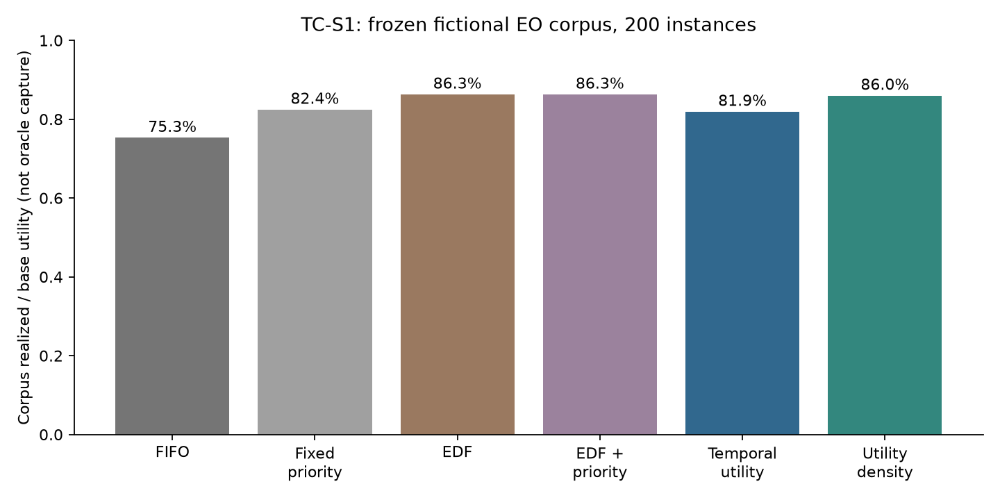
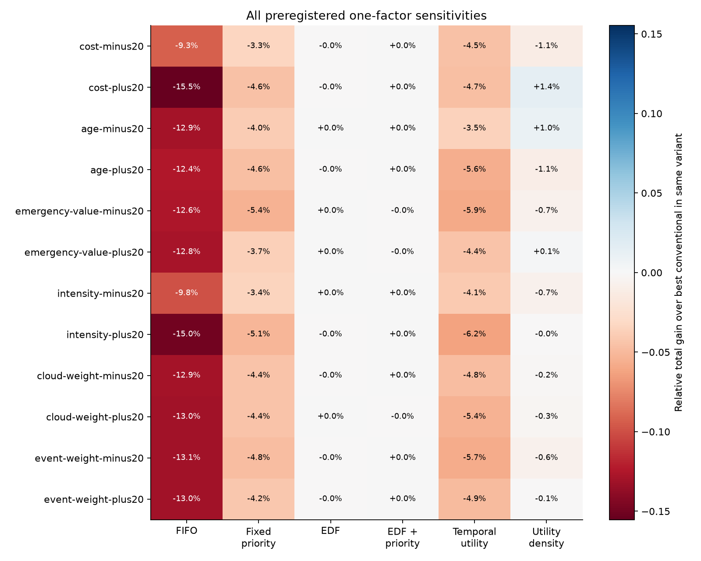

# TC-S1: the preregistered primary hypothesis failed

Temporal Utility earned **524,509** utility points across the frozen primary corpus; EDF earned **552,525**. The primary policy lost **5.07%**, rather than gaining the required 5%. All five preregistered gates failed. Utility Density earned 550,616 points, **0.35% below EDF**. This experiment does not justify adding contact-aware mechanisms.

## Registration and evidence boundary

The preregistration freeze is [`e5d7f916d45ddd63b97d0a50f5067f55a04fa726`](https://github.com/Kesh3805/temporal-compute/commit/e5d7f916d45ddd63b97d0a50f5067f55a04fa726), annotated tag `tc-s1-preregistered`. It was committed, pushed and [recorded on issue #2](https://github.com/Kesh3805/temporal-compute/issues/2#issuecomment-6021800956) before any EO policy outcomes. The first complete execution used clean source `aba8df62e0b485850193da35d3acc12d5c2c485c`. Frozen runtime, policy, generator, value-model, statistical analysis and gate inputs remain unchanged; there are no scientific errata or post-outcome tuning.

The exact hypothesis was:

> Across the frozen 200-instance Earth-observation corpus, Temporal Utility will achieve at least 5% more total realized mission utility than the strongest preregistered conventional baseline, with positive paired gains across multiple mission mixes and load regimes, without a material reduction in critical-task success.

The [evidence dossier](evidence.md) uses ESA Φsat-2 mission/application descriptions, Φsat-1 cloud-screening reports, a technical mission overview, NASA/JPL Dynamic Targeting and EO-1 Autonomous Sciencecraft primary sources. These support credible application classes and qualitative timing/resource motivations. **No numerical generator parameter is a measured mission quantity.** All durations, arrival rates, utility points, priorities, age budgets, mixture weights and success tolerances are D experimental assumptions; adversarial/negative controls are E. NASA's reported 60–90-second targeting workflow and a CloudScout prototype timing are contextual evidence, not adopted per-task costs.

The corpus is independent of scheduling policy, not an independently observed mission dataset. Results concern a fictional single-CPU, non-preemptive, known-cost, additive-value model. Acquisition is exogenous, products have no dependencies, and result availability is completion. Contacts, delivery, inference accuracy, energy, cloud-mask gating, preemption, runtime prediction error and flight qualification are absent. These omissions limit claims in both directions.

## Frozen corpus and reproducibility

There are 200 primary scenarios with 48 tasks each: **9,600 jobs**, five mixes (routine, emergency-heavy, cloud-heavy, maritime-heavy, mixed), four nominal loads (0.35, 0.80, 1.25, 2.00), and ten replicates per cell. The six classes are cloud screening, wildfire alerts, vessel detection, marine anomaly detection, compression and disaster mapping. Critical classes are wildfire and mapping.

The generator also defines 2,400 paired one-factor sensitivity scenarios, seven controls and forty derived nine-job oracle cases: **2,647 definitions**, evaluated under six policies, **15,882 policy runs**. Every run is simulated twice with exact Rust comparison of complete events, decisions and metrics: **31,764 simulations per execution**. Replay is a determinism check, not independent statistical replication.

Master seed is 20261006. Per-instance seeds use the first eight big-endian bytes of SHA-256 of `tc-s1-v1|master|kind|mix|load|replicate`. SplitMix64 supplies ten fixed latent words per task; no scheduler result enters generation. The [frozen manifest](../../research/tc-s1/corpus-manifest.json) records every definition's normalized canonical SHA-256. Regeneration matched all hashes. Corpus-manifest canonical digest is `debe86d3e2e59aa2473f0a91b89099b7661fcff7d1ad6fce6526e8546338c243`; specification digest is `5614ed13d7f95eb2948e63a8141608469769f69bad7513d3cf0bb864eb2d6ce9`.

Complete retained metrics, all event-stream hashes, forty oracle certificates and 48 representative full traces are in [canonical artifacts](../../results/tc-s1/README.md). Full compressed raw reports are regenerable local artifacts rather than a 132 MB repository blob. The artifact audit checks checksums, identities, counts, class reconciliation and representative trace hashes, then recomputes every reported statistic and exact oracle.

## Policies and primary outcomes

Every existing TC-0 policy retains its original implementation and tie rules. EDF + priority is an evaluation-only stronger conventional control: earliest deadline, then higher priority, then arrival/ID. Temporal Utility selects absolute predicted completion reward; Density selects reward per execution cost. The named primary is absolute Temporal Utility throughout; Density cannot replace it after outcomes.

| Policy | Total utility | Realized/base | Mean | Median | P10 | P90 |
| --- | ---: | ---: | ---: | ---: | ---: | ---: |
| FIFO | 482,139 | 75.28% | 2,410.70 | 2,269.5 | 1,312.4 | 3,459.6 |
| Fixed priority | 527,825 | 82.41% | 2,639.13 | 2,586.0 | 1,562.8 | 3,621.1 |
| EDF | **552,525** | **86.27%** | **2,762.63** | 2,746.0 | 1,609.1 | 3,728.7 |
| EDF + priority | 552,487 | 86.26% | 2,762.44 | 2,746.0 | 1,609.1 | 3,728.7 |
| Temporal Utility | 524,509 | 81.89% | 2,622.55 | 2,602.5 | 1,463.6 | 3,604.2 |
| Utility Density | 550,616 | 85.97% | 2,753.08 | 2,787.5 | 1,581.0 | 3,872.2 |

Base utility totals 640,477 for every policy. Normalization is realized/base utility, **not oracle capture**. The stronger EDF tie-breaker changes corpus utility by only -38 points; competent plain EDF already erases meaningful primary-policy benefit. Density's higher median does not imply a higher corpus total.

## Paired differences and uncertainty

Rows below are **Temporal Utility minus comparator**, paired on the same 200 inputs. The prespecified 10,000 paired stratified bootstrap resamples use seed 734921 and common sampled indices across four conventional comparisons. Intervals are pointwise percentile 95% intervals for mean raw delta, conditional on this generator/grid. They are neither mission-population inference nor simultaneous familywise coverage.

| Comparator | Wins/ties/losses | Total gain | Mean delta | Median delta | Delta P10/P90 | 95% mean-delta interval |
| --- | ---: | ---: | ---: | ---: | ---: | ---: |
| FIFO | 151/10/39 | +8.79% | +211.850 | +120.5 | -17.1 / +616.0 | [192.524, 231.225] |
| Fixed priority | 50/24/126 | -0.63% | -16.580 | -18.5 | -144.7 / +114.7 | [-31.000, -1.570] |
| EDF | **15/15/170** | **-5.07%** | **-140.080** | **-114.5** | **-350.0 / 0.0** | **[-154.725, -125.855]** |
| EDF + priority | 15/15/170 | -5.06% | -139.890 | -114.5 | -350.0 / 0.0 | [-154.645, -125.589] |
| Utility Density (secondary) | 15/19/166 | -4.74% | -130.535 | -94.5 | -347.3 / 0.0 | Not a registered bootstrap comparison |

Median normalized paired delta against EDF was **-0.03967**, versus the required +0.005. Worst individual losses against FIFO, fixed priority, EDF and EDF + priority were 225, 364, 563 and 563 points. Every raw paired delta and P25/P75 are retained, including losses.

## Breadth and sensitivity

Temporal Utility's aggregate gain against the strongest conventional policy in each group:

| Load | Gain | Mix | Gain |
| --- | ---: | --- | ---: |
| Underloaded | -0.73% | Routine | -5.56% |
| Moderate | -3.23% | Emergency-heavy | -1.65% |
| Overloaded | -8.01% | Cloud-heavy | -8.98% |
| Severe | -9.69% | Maritime-heavy | -6.98% |
| | | Mixed | -4.99% |

All twelve prespecified one-factor ±20% variations remain negative for the primary. Costs: -4.53% / -4.69%; age budgets: -3.52% / -5.63%; emergency values: -5.91% / -4.39%; arrival intensity: -4.12% / -6.24%; cloud weight: -4.80% / -5.39%; emergency weights: -5.71% / -4.94% (minus/plus respectively). Paired variants share seeds and are not independent replications. Age scaling jointly changes decay and feasibility; class-weight changes renormalize probabilities and regenerate the fixed latent draws, as registered.

Density exceeds the best conventional total in three sensitivity variants (cost +20%, age -20%, emergency value +20%), by approximately 1.4%, 1.0%, and 0.1%. It loses in the other nine and in the primary aggregate. These limited secondary results do not rescue the preregistered hypothesis or meet its robustness bar. The primary conclusion does not depend on one tested parameter choice.

## Critical tasks and displaced value

Success means completion with at least half the task's base utility, not merely completion before deadline. There are 1,233 wildfire and 1,438 mapping jobs, totaling 2,671 critical jobs.

| Policy | Wildfire success | Mapping success | Pooled critical success |
| --- | ---: | ---: | ---: |
| FIFO | 62.94% | 95.55% | 80.49% |
| Fixed priority | **97.24%** | 90.06% | **93.37%** |
| EDF | 97.08% | 84.49% | 90.30% |
| EDF + priority | 97.08% | 84.49% | 90.30% |
| Temporal Utility | **83.37%** | **95.41%** | **89.85%** |
| Utility Density | 88.16% | 89.43% | 88.84% |

Temporal Utility is 13.87 percentage points below the best conventional wildfire success and 3.52 points below pooled critical success, both beyond the 2-point tolerance. Only 72.63% of wildfire-containing instances and 88.44% of critical-containing instances meet the 10-point per-instance tolerance, below the required 90%. Mapping satisfies its own pooled and tail tests (gap -0.14 points; tail 92.78%). Strong mapping performance must not conceal alert degradation.

Temporal Utility retains 86.71% of mapping value, versus EDF's 75.53%, and 74.98% of wildfire value versus EDF's 84.29%. It expires 1,203 cloud jobs unstarted, versus EDF's 37; cloud value retention is 37.39% versus 79.34%. Vessel retention is 72.15% versus 94.95%. These modeled tradeoffs are consistent with absolute reward favoring slow high-value mapping work over lower-value short products. They are algorithm observations under assumed values, not conclusions about real emergency response.

| Policy | Completed / 9,600 | Expired unstarted | Deadline-hit rate | Wasted simulated CPU seconds |
| --- | ---: | ---: | ---: | ---: |
| FIFO | 8,113 | 1,487 | 84.13% | 1,831 |
| Fixed priority | 8,353 | 1,247 | 86.84% | 1,187 |
| EDF | 9,471 | 129 | 98.65% | 1,008 |
| EDF + priority | 9,471 | 129 | 98.65% | 1,032 |
| Temporal Utility | 7,705 | 1,895 | 80.16% | **340** |
| Utility Density | 8,729 | 871 | 90.83% | 702 |

Less zero-value compute does not guarantee more realized utility. Expired-unstarted measures finite-workload deprivation, not a proof about infinite-stream starvation. Class latency, age, maximum wait, zero-value completions and utility losses are retained in machine-readable artifacts.

## Negative and adversarial controls

These controls are explicitly synthetic and excluded from primary totals.

| Control | FIFO | Priority | EDF | EDF + priority | Temporal Utility | Density |
| --- | ---: | ---: | ---: | ---: | ---: | ---: |
| Constant value | 351 | 351 | 351 | 351 | 351 | 351 |
| Underload equivalence | 351 | 351 | 351 | 351 | 351 | 351 |
| Long urgent | 130 | 130 | 130 | 130 | 130 | **30** |
| Density starvation | 300 | 300 | 300 | 300 | 300 | **200** |
| Absolute starvation | 870 | 870 | 870 | 870 | **800** | 870 |
| Deadline dominant | 100 | **160** | **160** | **160** | 100 | 100 |
| Priority dominant | 80 | **180** | **180** | **180** | **180** | **180** |

Both measurement-equivalence controls passed. Density can sacrifice long urgent work or let repeated short jobs displace a long product. Absolute utility can displace an urgent lower-value alert. Deadline/priority controls confirm the baselines can win; no losing control was discarded.

## Exact reduced oracle

Forty prespecified nine-job derived problems use two replicates per mix/load cell, seeded subset selection and horizon rescaling. They are **not optimal references for the full 48-job primary scenarios**. Exact subset dynamic programming maintains nondominated time/value prefixes, permits skipping and release-time idling, and exploits nonincreasing value to restrict each fixed sequence to earliest feasible execution. Schedule certificates were independently evaluated; small synthetic instances also match exhaustive enumeration.

| Policy | Utility | Exact-oracle capture | Total regret | Worst per-case regret |
| --- | ---: | ---: | ---: | ---: |
| FIFO | 22,254 | 94.89% | 1,198 | 176 |
| Fixed priority | 22,680 | 96.71% | 772 | 78 |
| EDF | 23,107 | **98.53%** | **345** | 51 |
| EDF + priority | 23,107 | 98.53% | 345 | 51 |
| Temporal Utility | 22,435 | 95.66% | 1,017 | 97 |
| Utility Density | 22,889 | 97.60% | 563 | 79 |

Exact total is 23,452. No policy exceeded it. EDF's small reduced-problem regret supports conventional scheduling as a serious explanation; it does not prove EDF optimal or establish full-corpus oracle capture.

## Falsification and next research decision

**FAIL**, without relabeling the primary result PARTIAL. Aggregate gain/positive-baseline intervals, median benefit, breadth, sensitivity and critical preservation all fail. Temporal Utility improves on FIFO but loses to all three stronger conventional controls; a FIFO-only headline would misrepresent the experiment.

Select exactly one next direction: **D — stop or substantially rethink the incremental-advantage thesis before further mechanisms.** Both fixed temporal heuristics lose the primary total to EDF; the primary loses in every registered mix/load and all sensitivity variants; reduced exact problems leave EDF little room to improve. These data do not justify contact-aware Temporal Compute. A future materially different hypothesis would need a new independent protocol and evidence, not a retuned TC-S1 rerun.

This rejects the specified algorithmic advantage on this corpus. It does not disprove time-dependent value as a useful modeling abstraction, show all possible temporal policies must lose, or establish operational EO conclusions. Source-grounded but assumed value models remain a central limitation; the limited ±20% analysis does not cover arbitrary utility structures.

## Engineering validation

Phase A passed Rust formatting, strict workspace Clippy, all 17 Rust tests, locked release builds, fourteen Python protocol/generator/analysis tests, and Rust validation of all 2,647 definitions without EO outcomes. Phase B verified all 15,882 complete run replays, all executed input hashes, both negative controls, forty exact certificates and complete retained-artifact/statistical recomputation. The frozen analysis and all original runtime/policy sources are unchanged. Figure dependencies are isolated and pinned; charts show full fraction axes and common scales, with no interactive UI. Detailed final validation and cross-platform run links are recorded in the PR and issue #2.

Final local formatting, strict Clippy, 17 Rust tests, locked release builds and fourteen Python tests passed again. All **35 TC-0 canonical run records** (including complete events/decisions/metrics) match the original committed results. A second full TC-S1 process execution matched all seven scientific JSON artifacts and all 49 canonical uncompressed retained streams (complete metrics plus 48 traces). Original-run artifact checksums were also audited independently. These comparisons deliberately exclude host timing and source/tool provenance. Linux and Windows code/corpus/artifact validation passed in [run 37505854204](https://github.com/Kesh3805/temporal-compute/actions/runs/37505854204); [PR #7](https://github.com/Kesh3805/temporal-compute/pull/7) carries final cross-platform replay checks.

The first measured batch took about 95 seconds on this development host; this is reproducibility context, not a simulator speed benchmark or a mission compute measurement. Host/runtime/source provenance is excluded from scientific cross-execution comparisons.
